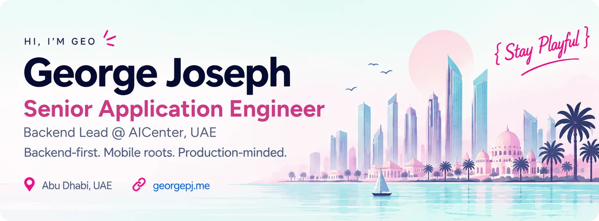
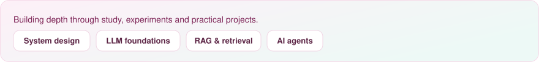

<picture><source media="(prefers-color-scheme: dark)" srcset="assets/ui/strip-dark.svg" /></picture>

Senior Application Engineer at **AICenter**, based in Abu Dhabi. I build backend services, identity platforms, enterprise integrations and realtime products, with a focus on reliable delivery and maintainable systems.

[Portfolio](https://georgepj.me) · [Knowledge base](https://kb.georgepj.me) · [LinkedIn](https://www.linkedin.com/in/georgepjoseph/) · [Get in touch](mailto:info@georgepj.me)

## Production case studies

Real world systems. Tangible impact.

<table>
<tr>
<td width="50%" valign="top">
<picture><source media="(prefers-color-scheme: dark)" srcset="assets/ui/tile-purelive-dark.svg" /></picture>
<h3>PureLive Suite</h3>

Identity verification with liveness, OCR/NFC, PKI, licensing and multi-platform SDKs.

<picture><source media="(prefers-color-scheme: dark)" srcset="assets/ui/tags-purelive-dark.svg" /></picture>
</td>
<td width="50%" valign="top">
<picture><source media="(prefers-color-scheme: dark)" srcset="assets/ui/tile-smartpass-dark.svg" /></picture>
<h3>SmartPass</h3>

Airport automation, passenger tracking, baggage integrations and operational alerts.

<picture><source media="(prefers-color-scheme: dark)" srcset="assets/ui/tags-smartpass-dark.svg" /></picture>
</td>
</tr>
<tr>
<td width="50%" valign="top">
<picture><source media="(prefers-color-scheme: dark)" srcset="assets/ui/tile-classmarine-dark.svg" /></picture>
<h3>Class Marine App</h3>

Marina operations with QuickBooks automation for invoices, inventory and payments.

<picture><source media="(prefers-color-scheme: dark)" srcset="assets/ui/tags-classmarine-dark.svg" /></picture>
</td>
<td width="50%" valign="top">
<picture><source media="(prefers-color-scheme: dark)" srcset="assets/ui/tile-faceblade-dark.svg" /></picture>
<h3>FaceBlade</h3>

Face recognition on Vuzix smart glasses, with local caching and device management.

<picture><source media="(prefers-color-scheme: dark)" srcset="assets/ui/tags-faceblade-dark.svg" /></picture>
</td>
</tr>
<tr>
<td width="50%" valign="top">
<picture><source media="(prefers-color-scheme: dark)" srcset="assets/ui/tile-smarttrack-dark.svg" /></picture>
<h3>SmartTrack</h3>

RFID and face recognition for live movement, attendance and access monitoring.

<picture><source media="(prefers-color-scheme: dark)" srcset="assets/ui/tags-smarttrack-dark.svg" /></picture>
</td>
<td width="50%" valign="top">
<picture><source media="(prefers-color-scheme: dark)" srcset="assets/ui/tile-bestmarine-dark.svg" /></picture>
<h3>Best Marine Floating Island</h3>

Event reservations, slot availability, amenities, notifications and payment workflows.

<picture><source media="(prefers-color-scheme: dark)" srcset="assets/ui/tags-bestmarine-dark.svg" /></picture>
</td>
</tr>
</table>

Selected professional work. Explore the [project stories on my portfolio](https://georgepj.me/#projects).

<b>Inside the delivery: responsibilities and workflows</b>

### PureLive Suite · Identity verification

- Backend and SDK platform for liveness detection and identity verification.
- PKI security, short-lived tokens, authentication, licensing and analytics.
- OCR and NFC document workflows, with support across client platforms.

### SmartPass · Airport automation

- Passenger onboarding, indoor tracking and operational notifications.
- Baggage and check-in integrations, crowd monitoring and blacklist alerts.
- Backend workflows connecting passenger data, external systems and realtime events.

### Class Marine App · Enterprise integration

- QuickBooks workflows for customers, vendors, purchase orders and stock.
- Invoice, estimate and payment automation across marina operations.
- Integration services connecting business workflows with accounting data.

### FaceBlade · Connected devices

- Multi-face detection and recognition on Vuzix Blade smart glasses.
- Local caching, person tracking and device/user management.
- Android delivery connecting computer vision with backend services.

### SmartTrack · Security monitoring

- Live movement tracking using RFID and face recognition.
- Attendance, time tracking and access monitoring for security teams.

### Best Marine Floating Island · Booking and payments

- Slot reservations, availability, amenities and event customization.
- Payment-related backend flows and customer notification workflows.

<b>More from my portfolio: mobile, streaming, security and product delivery</b>

| Project | Delivery context |
| :--- | :--- |
| Cinesoft IPTV App | Streaming and TV experiences across Android TV, Firestick and OTT devices |
| KnightFox | Android anti-theft, remote device management, cloud backup and restore |
| SmartSchoolDiary | Parent/teacher communication, attendance, homework and bus notifications |
| Flowers A. R. Rahman Show App | Event content, media and show updates; Bitryt delivery for Flowers Channel |
| DFS Shredder | Android secure-deletion workflows for files, storage and free space |
| Filchy Monkey | AndEngine-based Android game with scoring, hazards and power-ups |

Earlier delivery also spans CRM, ERP, surveys, restaurant and retail applications.

[Explore the full portfolio →](https://georgepj.me/#projects)

## The CANDY toolkit

Tools I use to build, ship and scale.

**C**ore backend systems · **A**PIs & automation · **N**ative mobile · **D**ocument & identity intelligence · **Y**ield-focused delivery

**Backend** &nbsp;  

**Data** &nbsp;  

**Delivery** &nbsp;  

<picture><source media="(prefers-color-scheme: dark)" srcset="assets/ui/icon-mobile-dark.svg" /></picture> &nbsp;**Mobile roots** — native Android, Kotlin, Java, Flutter and Dart, with SDK delivery and Android TV / Firestick.

<b>Full toolkit — all 47 badges across 8 groups</b>

#### Backend & APIs

    

REST · SOAP · OpenAPI · JSON / XML · Middleware · Webhooks · Provider adapters · API design

#### Data & caching

    

Data modeling · Indexing · Aggregation · Query optimization · Migrations · Mongoose · Relational and document stores

#### Realtime & messaging

    

WebSockets · Pub/sub · Message queues · Realtime notifications · Event-driven workflows

#### Cloud & delivery

    

CI/CD · Deployment · AWS S3 / CloudWatch / Cognito · Firebase messaging and realtime data · Process management

#### Quality & observability

      

Unit testing · API testing · Logging · Monitoring · Tracing · Code reviews · Load testing with JMeter

#### Security & identity

  

OIDC · RBAC · PKI · TTL tokens · Input validation · Webhook security · OCR / MRZ / NFC · Liveness · Face recognition

#### Mobile roots

     

Native Android · Mobile-connected backends · SDK delivery · Android Jetpack · ExoPlayer · Android TV / Firestick

#### Web & developer tools

         

HTML · CSS · JavaScript · Responsive interfaces · API consumption · Version control · AI-assisted development

#### Integration domains and engineering practices

**Integrations:** QuickBooks, Google APIs, Firebase, payment providers, REST/SOAP services, accounting workflows and webhooks.

**Architecture:** OOP, SOLID, clean architecture, design patterns, MVC / MVVM / MVI, data access boundaries and microservices. I favor KISS and DRY while keeping the domain and operating constraints explicit.

**Delivery:** OpenAPI documentation, Agile/Scrum, code review, release support and practical technical leadership.

## Engineering approach

How I build, and what I optimise for.

<picture><source media="(prefers-color-scheme: dark)" srcset="assets/ui/appr-contracts-dark.svg" /></picture> &nbsp;**Clear contracts** — explicit API boundaries, validation and predictable integrations.

<picture><source media="(prefers-color-scheme: dark)" srcset="assets/ui/appr-security-dark.svg" /></picture> &nbsp;**Security by design** — authentication, authorization and identity workflows built into the system.

<picture><source media="(prefers-color-scheme: dark)" srcset="assets/ui/appr-observability-dark.svg" /></picture> &nbsp;**Operational visibility** — useful logs, monitoring and traceable failures.

<picture><source media="(prefers-color-scheme: dark)" srcset="assets/ui/appr-architecture-dark.svg" /></picture> &nbsp;**Practical architecture** — clean data flows, maintainable services and scalability driven by the problem.

<picture><source media="(prefers-color-scheme: dark)" srcset="assets/ui/appr-mentor-dark.svg" /></picture> &nbsp;**Leadership & mentorship** — mentored **60+ interns and developers** through code reviews, architecture guidance, hands-on training and delivery support. Recognized for **Performance Excellence in Mentorship**.

My path runs from Android engineering and technical leadership to backend platforms and enterprise delivery. I bring mobile experience, product thinking and responsibility for production behavior to backend work.

[Career journey](https://georgepj.me/#experience) · [Mentorship](https://georgepj.me/#mentorship)

## Currently exploring

Ongoing learning. Always curious.

<picture><source media="(prefers-color-scheme: dark)" srcset="assets/ui/explore-dark.svg" /></picture>

<b>Learning tracks in detail</b>

| Track | Focus |
| :--- | :--- |
| System design | Architecture, domain modeling, caching and integration patterns |
| AI engineering | ML foundations, LLM fundamentals, prompting, retrieval workflows, RAG, tool use and AI agents |
| Platform reliability | Containers, Kubernetes, cloud deployment and observability |
| Engineering foundations | DSA and problem solving, testing, technical documentation, React / Next.js and UI engineering |

I use learning projects to connect architecture, data, platform reliability and AI engineering.

[Follow my learning notes →](https://kb.georgepj.me)

---

<a href="https://georgepj.me">Portfolio</a> · <a href="https://kb.georgepj.me">Knowledge base</a> · <a href="https://www.linkedin.com/in/georgepjoseph/">LinkedIn</a> · <a href="mailto:info@georgepj.me">Email</a>

